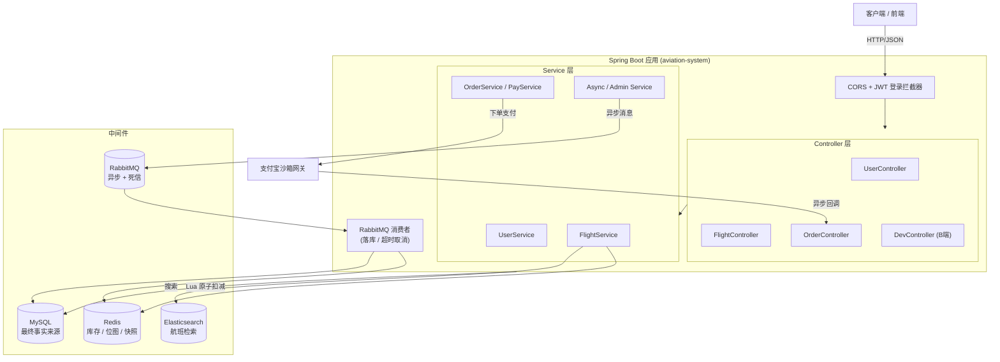
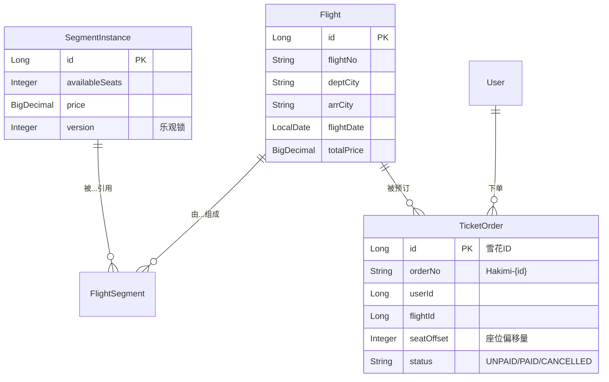
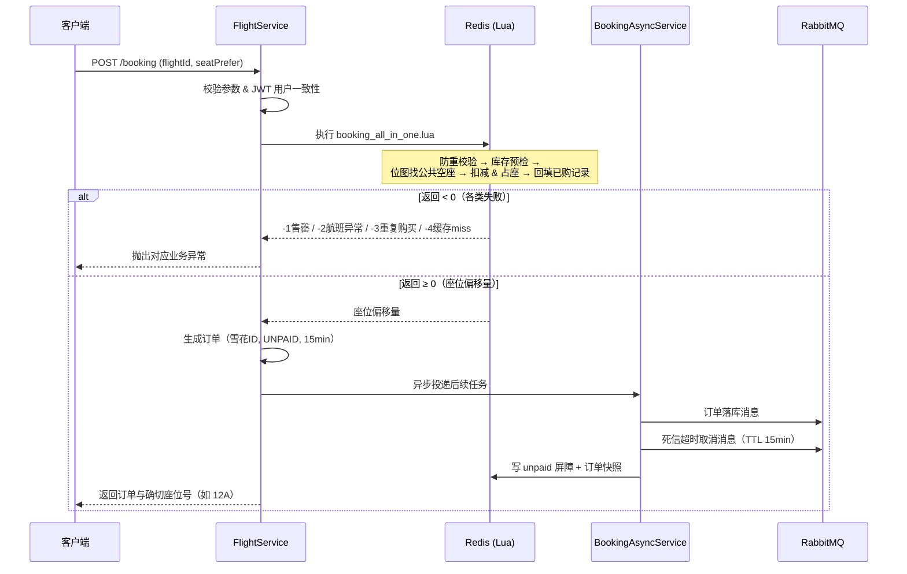

# 哈基米航空 (Hakimi Airline)

> **你好，世界！** 👋
>
> 我是 **Edison**，这是我的第二个 Java 后端实战项目。
>
> 项目聚焦于**高并发场景下的并发控制**与**极端异常下的资金与状态安全**。核心交易链路已打通，目前仍在持续迭代中。在面对复杂的故障容灾时，优先采用服务降级、兜底返回与快速失败 + B 端人工介入的策略，防止雪崩并守住资金安全底线。
>
> 对于边缘故障的容灾处理仍有优化空间。开源的意义在于交流，如果你对高并发抢票、一致性补偿有更好的见解，欢迎提交 Issue 或直接联系我。
>
> *(核心接口规范请参阅根目录下的 [`APIs.md`](./APIs.md))*

---

## 📖 项目简介

**哈基米航空**是一个基于 Spring Boot 3 构建的高并发机票预订系统，模拟了从**航班搜索 → 抢票占座 → 下单支付 → 超时取消 / 退款**的完整机票交易链路。

项目的核心目标是解决高并发交易场景下的三大经典难题：

- **库存超卖**：如何在瞬时高并发下保证「一票不多卖、一座不重叠」。
- **分布式数据一致性**：Redis（缓存/库存）、MySQL（最终事实）、Elasticsearch（搜索）、RabbitMQ（异步）四方数据如何最终对齐。
- **资金与状态安全**：在支付回调、超时取消、异常重试等并发交织的场景下，如何保证订单状态机不错乱、资金不损失。

系统采用 **Redis 前置屏障 + MySQL 最终兜底**的分层架构：Redis 借助 Lua 脚本承接抢票洪峰并完成原子化的防重、扣减与占座，MySQL 作为数据的最终事实来源守住资金底线，Elasticsearch 支撑毫秒级航班搜索，RabbitMQ 负责异步落库削峰与订单超时的死信调度。

---

## 🚀 核心特性

- 🔍 **高性能搜票** —— 基于 Elasticsearch + Redis 二级架构实现毫秒级航班搜索，ES 负责静态信息检索与排序，Redis Pipeline 实时缝合库存，具备**数据库降级 + 信号量限流**兜底。
- 🎫 **高并发抢票** —— 通过 **Redis + Lua 脚本**实现单次交互内的原子化「防重校验 → 库存预检 → 座位位图分配 → 库存扣减」，从根源上杜绝超卖与重复占座。
- 💺 **物理座位分配** —— 使用 Redis BitMap 位图为多航段行程分配**公共空座**，支持靠窗/过道/中间的座位偏好探测。
- 📦 **分布式异步下单** —— 引入 RabbitMQ 异步解耦订单落库等耗时操作，削峰填谷，主链路只做内存级操作，提升接口响应速度。
- ⏰ **超时取消与容灾恢复** —— 基于 RabbitMQ **死信队列**实现订单 15 分钟超时自动取消，结合 Redis 幂等屏障与数据库乐观锁，保障重试场景下的库存与资金一致性。
- 💰 **支付集成** —— 集成支付宝沙箱支付，具备防重复回调、支付验签、金额核对机制，以数据库乐观锁进行最终一致性兜底，并对「支付成功但订单已超时」的边缘场景触发异步退款。
- 🛡️ **服务降级与快速失败** —— ES / Redis / 缓存快照等任一中间件异常时均有对应的降级路径或快速失败策略，防止故障蔓延成雪崩。
- 🔐 **安全与鉴权** —— 使用 JWT 进行无状态身份认证，图形验证码 + 邮箱验证码双重校验注册，敏感配置全部通过环境变量隔离。

---

## 🏗️ 系统架构



**核心思想：Redis 前置屏障 + MySQL 最终兜底**

1. 绝大多数抢票请求在 Redis（Lua 脚本）层就被拦截或成功扣减，不触碰数据库；
2. 落库、状态变更等耗时操作通过 RabbitMQ 异步化，主链路保持轻量；
3. MySQL 作为数据的最终事实来源，在支付回调等强一致场景以乐观锁做最终对账兜底。

---

## 🛠️ 技术栈

### 核心框架

| 技术 | 版本 | 说明 |
|-----|------|------|
| **Spring Boot** | 3.5.13 | 核心框架 |
| **Java** | 17 | 编程语言 |
| **Maven** | 3.6+ | 项目构建工具 |
| **MyBatis-Plus** | 3.5.5 | ORM 框架（乐观锁、逻辑删除、雪花 ID） |

### 数据存储与中间件

| 组件 | 用途 |
|-----|------|
| **MySQL 8.0** | 关系型数据库，业务数据最终事实来源 |
| **Redis (Lettuce)** | 库存扣减、座位位图、订单快照、分布式屏障、缓存 |
| **Elasticsearch** | 航班全文检索与多维排序 |
| **RabbitMQ** | 异步落库削峰、死信队列超时取消 |

### 缓存方案

| 方案 | 用途 |
|-----|------|
| **Redis** | 分布式缓存、库存与占座、订单快照 |
| **Caffeine** | 本地内存缓存 |
| **Spring Cache** | 统一缓存抽象层 |

### 安全与第三方

| 依赖 | 版本 | 说明 |
|-----|------|------|
| **JJWT** | 0.7.0 | 无状态身份认证令牌 |
| **easy-captcha** | 1.6.2 | 图形验证码生成 |
| **Alipay SDK** | 4.40.753.ALL | 支付宝沙箱支付 |
| **Spring Mail** | - | 邮箱验证码（QQ SMTP） |
| **Thymeleaf** | - | 邮件模板渲染 |
| **MD5** | - | 用户密码加密 |

### 工具库

| 依赖 | 说明 |
|-----|------|
| **Lombok** | 简化实体 / POJO 样板代码 |
| **Commons Lang3** | 常用工具类 |
| **Commons Pool2** | Lettuce 连接池支持 |
| **Spring Validation** | 请求参数校验 |

---

## 📂 项目结构

```
aviation-system/
├── src/
│   ├── main/
│   │   ├── java/com/hakimi/aviation/
│   │   │   ├── AviationSystemApplication.java      # 启动类 (@EnableAsync/@MapperScan)
│   │   │   ├── alipay/                             # 支付宝集成
│   │   │   │   ├── AlipayConfig.java              # AlipayClient 装配
│   │   │   │   ├── AlipayConfigProperties.java    # 支付宝配置属性
│   │   │   │   ├── AlipayCallbackUtil.java        # 回调验签工具
│   │   │   │   └── AlipayProcess.java             # 退款等异步流程
│   │   │   ├── annotations/
│   │   │   │   └── LoginOptional.java             # 登录可选注解
│   │   │   ├── common/
│   │   │   │   ├── JsonData.java                  # 全局统一响应体
│   │   │   │   └── SeatProbeFactory.java          # 座位偏好探测序列工厂
│   │   │   ├── component/FlightData/              # 航班数据初始化组件
│   │   │   │   ├── BlueprintLoader.java           # 航班蓝图加载器
│   │   │   │   └── DataInitiator.java             # 试金石数据生成器
│   │   │   ├── config/                            # 配置类
│   │   │   │   ├── RedisTemplateConfig.java       # Redis 序列化配置
│   │   │   │   ├── ThreadPoolConfig.java          # 短信 / 下单异步线程池
│   │   │   │   ├── InterceptorConfig.java         # 拦截器注册
│   │   │   │   ├── MybatisPlusConfig.java         # 乐观锁等插件
│   │   │   │   └── RedisKey.java                  # Redis Key 常量定义
│   │   │   ├── consumer/
│   │   │   │   └── OrderConsumer.java             # 落库 & 超时取消消费者
│   │   │   ├── controller/                        # API 控制层
│   │   │   │   ├── UserController.java            # 用户 API
│   │   │   │   ├── FlightController.java          # 搜索 & 抢票 API
│   │   │   │   ├── OrderController.java           # 支付 & 取消 API
│   │   │   │   └── DevController.java             # B 端 / 运维 API
│   │   │   ├── dto/
│   │   │   │   └── FlightBlueprintDTO.java        # 航班蓝图 DTO
│   │   │   ├── entity/                            # 数据库实体
│   │   │   │   ├── Flight.java                    # 航班（聚合视图）
│   │   │   │   ├── FlightSegment.java             # 航班-航段关联
│   │   │   │   ├── SegmentInstance.java           # 航段实例（真实库存载体）
│   │   │   │   ├── TicketOrder.java               # 机票订单
│   │   │   │   └── User.java                      # 用户
│   │   │   ├── enums/
│   │   │   │   └── BizCodeEnum.java               # 业务状态码
│   │   │   ├── es/
│   │   │   │   └── FlightIndexDoc.java            # ES 航班索引文档
│   │   │   ├── exception/                         # 异常体系
│   │   │   │   ├── BizException.java              # 自定义业务异常
│   │   │   │   └── CustomExceptionHandler.java    # 全局异常处理
│   │   │   ├── interceptor/                       # HTTP 拦截器
│   │   │   │   ├── LoginInterceptor.java          # JWT 鉴权
│   │   │   │   └── CorsInterceptor.java           # 跨域
│   │   │   ├── mapper/                            # MyBatis-Plus Mapper
│   │   │   ├── message/                           # MQ 配置与消息体
│   │   │   │   ├── config/RabbitMQConfig.java     # 队列/交换机/死信声明
│   │   │   │   └── order/                         # 订单消息体
│   │   │   ├── model/
│   │   │   │   ├── request/                       # 请求 DTO (user/flight/order)
│   │   │   │   └── vo/                            # 响应 VO
│   │   │   ├── repository/
│   │   │   │   └── FlightIndexRepository.java     # ES Repository
│   │   │   ├── script/
│   │   │   │   └── LuaScript.java                 # Lua 脚本 Bean 装配
│   │   │   ├── service/                           # 业务逻辑层
│   │   │   │   ├── user/                          # 用户业务
│   │   │   │   ├── flight/                        # 搜索 & 抢票业务
│   │   │   │   ├── order/                         # 订单 & 支付业务
│   │   │   │   └── admin/                         # B 端 & 异步业务
│   │   │   └── util/                              # 工具类
│   │   │       ├── JWTUtils.java                  # JWT 签发 / 校验
│   │   │       ├── MD5Util.java                   # 密码加密
│   │   │       ├── EmailUtil.java                 # 邮件发送
│   │   │       ├── AirportCityUtil.java           # 机场城市映射
│   │   │       └── ValidateRequest.java           # 请求前置校验
│   │   └── resources/
│   │       ├── application.yaml                    # 应用配置
│   │       ├── flight_blueprints.json              # 航班蓝图（初始化数据源）
│   │       ├── lua/                                # Redis Lua 脚本
│   │       │   ├── booking_all_in_one.lua         # 抢票原子脚本（核心）
│   │       │   ├── deduct_stock.lua               # 库存扣减脚本
│   │       │   └── rollback_stock.lua             # 库存/座位回滚脚本
│   │       ├── mapper/                             # MyBatis XML 映射
│   │       ├── templates/email-code.html           # 邮件验证码模板
│   │       └── static/                             # 静态资源
│   └── test/                                       # 测试代码 & JMeter 数据生成
├── APIs.md                                         # API 接口文档
├── pom.xml                                         # Maven 依赖配置
├── mvnw & mvnw.cmd                                 # Maven Wrapper
└── README.md                                       # 本文件
```

---

## 🗃️ 核心数据模型

系统的库存模型采用**「航班（Flight）—— 航段实例（SegmentInstance）」分离**的设计，以支持中转航班的多航段独立库存管理。

### 实体关系

- 一个 **Flight**（航班）是面向 C 端展示的聚合视图，可由一个或多个 **SegmentInstance**（航段实例）串联组成（如「北京→上海」直飞为 1 段，「北京→武汉→上海」中转为 2 段）。
- **FlightSegment** 是航班与航段实例的关联表，通过 `segOrder` 记录航段顺序。
- 真实的**库存（availableSeats）、座位、价格、乐观锁版本号**都挂在 **SegmentInstance** 上。一个航班的可售余票 = 其所有航段中的**最小库存（木桶短板）**。



### 关键字段说明

| 实体 | 关键字段 | 说明 |
|-----|---------|------|
| `Flight` | `dept_city` / `arr_city` / `flight_date` | 搜索联合索引字段 |
| `SegmentInstance` | `available_seats` | 真实库存，支付回调时以此做数据库兜底 |
| `SegmentInstance` | `version` | `@Version` 乐观锁，防止并发扣减超卖 |
| `TicketOrder` | `seat_offset` | 座位偏移量，`/6+1` 得排号、`%6` 映射 A~F 座位 |
| `TicketOrder` | `status` | 订单状态机：`UNPAID` → `PAID` / `CANCELLED` |
| `User` | `password` | MD5 加密存储 |
| `User` | `is_deleted` | `@TableLogic` 逻辑删除 |

---

## 🔑 Redis Key 设计

Redis 是本系统抢票链路的核心，承载库存、占座、防重与订单快照等多重职责。

| Key 模式 | 数据结构 | 用途 | 生命周期 |
|---------|---------|------|---------|
| `stock:seg:{segInstanceId}` | String | 航段实例实时库存 | 常驻 |
| `seatmap:seg:{segInstanceId}` | BitMap | 航段座位占用位图 | 常驻 |
| `route:flight:{flightId}` | List | 航班的航段路由（含各航段 ID） | 常驻 |
| `info:flight:{flightId}` | Hash | 航班信息（含 `total_price`） | 常驻 |
| `order:notFinish:{userId}` | Set | 用户未结束行程，用于抢票防重 | 登录时写入，TTL 7 天 |
| `order:unpaid:{userId}` | Set | 用户未支付订单，兼作超时取消 / 支付的分布式屏障 | 下单后写入，TTL 24 小时 |
| `order:snapshot:{orderId}` | Hash | 订单快照（支付所需的金额、座位等） | 下单后写入，TTL 20 分钟 |
| `captcha:{uuid}` | String | 图形验证码 | 120 秒 |

---

## 🧩 主要模块功能说明

### 1. 用户模块（UserController / UserService）
- **图形验证码**：`easy-captcha` 生成 Base64 验证码，UUID 作 Key 存入 Redis（120s）。
- **邮箱验证码**：通过图形验证码后，经 QQ SMTP 发送邮箱验证码，Thymeleaf 渲染邮件模板。
- **用户注册**：校验双重验证码，MD5 加密密码，对邮箱加锁防止多端重复注册。
- **用户登录**：校验邮箱/密码，签发有效期一周的 JWT（前缀 `hajimi`）。

### 2. 航班搜索模块（FlightController / FlightService）
- **高性能搜索** `search`：ES 检索航班静态信息并排序（起飞时间 / 价格），Redis Pipeline 批量缝合各航段实时库存，取木桶短板作为余票。
- **数据库降级搜索** `search_flight`：中间件宕机时的紧急逃生通道，直连 MySQL 联合索引查询，配合信号量限流（最多 30 并发）防止打爆数据库。
- **多级降级**：ES 异常 → 降级查库；Redis 异常 → 返回静态数据并标记「余票待查（-1）」等待 B 端检修。

### 3. 抢票预订模块（FlightController#booking / FlightService）
- **核心抢票接口**：从 JWT 解析用户身份（不信任前端），调用 `booking_all_in_one.lua` 一次性完成防重、库存预检、座位分配与扣减。
- **异步落库**：抢票成功后交由 `BookingAsyncService` 异步处理 MQ 落库、写未支付记录、写订单快照、发送死信超时消息。
- **座位偏好**：支持 `window` / `aisle` / `middle`，由 `SeatProbeFactory` 生成优先探测序列。

### 4. 订单与支付模块（OrderController / PayService / OrderService）
- **发起支付** `pay`：从订单快照组装支付宝下单参数，返回自动提交的 `<form>` HTML。
- **支付回调** `pay/callback`：验签 → 金额核对 → 删除未支付屏障 → 乐观更新订单为 `PAID` → 数据库扣减库存兜底 → 删除快照；对「已支付但订单被取消」触发异步退款。
- **主动取消** `cancel`：以未支付 Set 作为屏障，乐观更新订单为 `CANCELLED`，经 `rollback_stock.lua` 回滚库存与座位。

### 5. 异步与消费者模块（consumer / service.admin.async）
- **落库消费者**：监听订单队列异步插入订单，主键冲突触发幂等防御，异常则 NACK 重回队列（指数退避 1s→2s→4s）。
- **超时取消消费者**：监听死信队列，结合 `srem` 原子结果与 `isRedelivered` 判定幂等，乐观更新订单状态并回滚库存座位。

### 6. B 端 / 运维模块（DevController / service.admin）
- **数据初始化** `/dev/init`：按航班蓝图生成指定日期的「试金石」测试数据到 MySQL 与 Redis。
- **数据同步** `/dev/flight/sync`：将数据库航班全量同步至 Redis 与 Elasticsearch。
- **创建航班** `/dev/flight/new`：在既有航段实例基础上创建新航班并同步至 ES / Redis。

---

## 🔄 核心业务流程详解

### 抢票下单流程



**Lua 脚本 `booking_all_in_one.lua` 返回值约定：**

| 返回值 | 含义 | 处理策略 |
|-------|------|---------|
| `≥ 0` | 抢票成功，值为座位偏移量 | 生成订单 |
| `-1` | 库存不足 / 无公共空座 | 提示「机票已售罄」 |
| `-2` | 航班数据异常（航段丢失） | 暂停售卖，上报 B 端人工介入 |
| `-3` | 检测到重复购票 | 提示「已购买过此航班」 |
| `-4` | 用户行程缓存 miss | 降级查库回填缓存后重试 |

### 超时取消流程（死信队列）

下单成功即向死信队列投递一条 TTL 为 15 分钟的消息。若 15 分钟内未支付，消息过期转投取消队列，消费者执行：以 `srem` 原子移除未支付屏障判定幂等 → 结合 `isRedelivered` 区分重复消息与异常重试 → 乐观更新订单为 `CANCELLED` → `rollback_stock.lua` 回滚库存与座位位图。

### 支付回调对账流程

支付宝异步回调 → 验签 + 状态过滤 + 金额核对 → 删除未支付屏障（兼作分布式锁）：
- **删除成功**：乐观更新订单为 `PAID`，数据库扣减航段库存（`version` 乐观锁兜底，扣减失败则抛异常回滚事务，防止极端超卖），删除快照。
- **删除失败**：说明订单已被取消或为重复回调，进一步核查数据库状态——若为 `CANCELLED` 则触发**异步退款**，否则视为重复回调忽略。

---

## 💡 核心设计亮点

1. **Redis 前置屏障 + MySQL 最终兜底**：Redis 拦截绝大多数无效请求并承接扣减，MySQL 作为数据最终事实来源，职责清晰、各司其职。
2. **Lua 脚本原子操作**：单次 Redis 交互完成防重校验、库存预检、座位位图锁定与扣减，避免多次网络往返带来的竞态与开销。
3. **BitMap 物理占座**：以位图为每个航段维护座位占用状态，对多航段行程求「公共空座」，实现中转航班的一致占座。
4. **幂等状态机设计**：超时取消通过 `srem` 原子操作判定幂等，结合 `isRedelivered` 区分重复消息与异常重试，简化异常流转。
5. **多级服务降级**：ES → 数据库、Redis → 静态数据、缓存 → 数据库，任一中间件故障都有对应逃生路径，并以信号量对降级查库限流。
6. **乐观锁资金兜底**：`SegmentInstance.version` + 订单状态条件更新，保证支付回调等强一致场景下不超卖、不错扣。
7. **异步削峰**：抢票主链路仅做内存级操作，落库与消息投递交由独立线程池 + RabbitMQ 异步完成。

---

## 📡 API 接口文档

接口契约（全部端点、请求/响应字段、VO 结构、错误码、支付与 WebSocket 流程）以根目录 **[`APIs.md`](./APIs.md)** 为**唯一权威来源**。

- **Base URL（本机联调）**：`http://127.0.0.1:8080/api/v1` —— baseURL 已含 `/api/v1`，调用时以 `/pri/...` 开头，勿重复拼前缀（详见 APIs.md §1）
- **统一响应体**：`{ code, data, msg, timestamp }`，成功恒为 `code === 200`
- **鉴权**：需登录接口在 Header 传 `token: hajimi....`（登录返回值原样放入）

> 📌 新增或变更接口时**只更新 `APIs.md`**，本文件不再维护接口明细，避免两处失步。

---

## 📋 业务状态码（BizCodeEnum）

业务码分区：`<10` 通用 · `201-299` 用户 · `301-399` 航班/交易 · `401-499` B 端。成功恒为 `code = 200`。

> 完整错误码对照表见 **[`APIs.md` §1.4 全局错误码表](./APIs.md)**。

---

## ⚙️ 配置说明

关键配置位于 `src/main/resources/application.yaml`，**所有敏感信息均通过环境变量注入**。

### 需要配置的环境变量

| 环境变量 | 说明 |
|---------|------|
| `HAKIMI_DB_PWD` | MySQL 数据库密码 |
| `SERVER_IP` | Redis / RabbitMQ 所在服务器 IP |
| `HAKIMI_REDIS_PWD` | Redis 密码 |
| `HAKIMI_RABBITMQ_PWD` | RabbitMQ 密码 |
| `HAKIMI_JWT_SECRET` | JWT 签名密钥（缺省回退 `default_secret_for_dev`） |
| `EMAIL_HOST` | 发件邮箱地址 |
| `EMAIL_PWD` | 邮箱 SMTP 授权码 |
| `ALIPAY_PRIVATE_KEY` | 支付宝应用私钥 |
| `ALIPAY_PUBLIC_KEY` | 支付宝公钥 |
| `CPOLAR_DOMAIN` | 内网穿透域名（用于支付宝异步回调地址） |

### 主要配置概览

```yaml
server:
  port: 8080

spring:
  datasource:
    url: jdbc:mysql://127.0.0.1:3306/hajimi_aviation?...&serverTimezone=Asia/Shanghai
    username: root
    password: ${HAKIMI_DB_PWD}
  elasticsearch:
    uris: http://127.0.0.1:19200      # 通过 SSH 隧道映射服务器 9200 端口
  data:
    redis:
      host: ${SERVER_IP}
      port: 6379
      password: ${HAKIMI_REDIS_PWD}
      database: 1                      # 本系统使用 1 号库
  rabbitmq:
    host: ${SERVER_IP}
    virtual-host: /hakimi_airline
    listener:
      simple:
        acknowledge-mode: manual       # 手动 ACK
        prefetch: 1
        retry:
          enabled: true
          max-attempts: 3              # 失败重试，1s→2s→4s 指数退避
```

> 📌 **提示**：`application.yaml` 中 Elasticsearch 通过本机 `19200` 端口经 SSH 隧道连接远端 `9200`，以规避网络代理对安全组策略的干扰；如为本地部署，改回 `http://127.0.0.1:9200` 即可。

---

## 📦 环境要求

### 必需环境

- **JDK** 17 或更高版本
- **Maven** 3.6+（或使用自带的 Maven Wrapper）

### 依赖服务

| 服务 | 建议版本 | 用途 |
|-----|---------|------|
| **MySQL** | 8.0+ | 业务数据存储（库 `hajimi_aviation`） |
| **Redis** | 5.0+ | 库存 / 座位 / 快照 / 缓存（使用 1 号库） |
| **Elasticsearch** | 7.x+ | 航班搜索 |
| **RabbitMQ** | 3.8+ | 异步消息 & 死信队列（vhost `/hakimi_airline`） |
| **SMTP 邮件服务** | - | 邮箱验证码（如 QQ 邮箱） |
| **支付宝沙箱** | - | 支付能力（沙箱 AppID 已内置示例） |

---

## 🚀 安装与运行

### 1. 克隆项目

```bash
git clone <项目仓库地址>
cd aviation-system
```

### 2. 准备依赖服务

确保 MySQL、Redis、RabbitMQ、Elasticsearch 均已启动。可使用 Docker 快速拉起：

```bash
# Redis
docker run -d -p 6379:6379 redis:latest --requirepass yourpassword

# RabbitMQ（含管理面板 15672）
docker run -d -p 5672:5672 -p 15672:15672 rabbitmq:management

# Elasticsearch（单节点）
docker run -d -p 9200:9200 -e "discovery.type=single-node" \
  docker.elastic.co/elasticsearch/elasticsearch:7.17.0
```

并在 MySQL 中创建数据库：

```sql
CREATE DATABASE hajimi_aviation CHARACTER SET utf8mb4 COLLATE utf8mb4_unicode_ci;
```

> 数据库表结构与初始化数据可自行准备，或联系作者获取。

### 3. 配置环境变量

按[配置说明](#️-配置说明)中的表格设置好所有环境变量（数据库、Redis、RabbitMQ、JWT、邮箱、支付宝等）。

### 4. 构建与运行

```bash
# 使用 Maven Wrapper 构建（推荐）
./mvnw clean package -DskipTests

# 运行
java -jar target/aviation-system-0.0.1-SNAPSHOT.jar

# 或直接运行
./mvnw spring-boot:run
```

也可在 IDE 中直接运行 `AviationSystemApplication` 的 `main` 方法。

### 5. 初始化数据

服务启动后，调用 B 端接口生成测试航班数据并同步到 Redis / ES：

```bash
curl "http://localhost:8080/dev/init?days=1"
curl "http://localhost:8080/dev/flight/sync"
```

应用默认运行在 `http://localhost:8080`。

---

## ❓ 常见问题（FAQ）

**Q1：搜索接口返回的余票是 `-1` 是什么意思？**
`-1` 代表「余票待查 / 系统维护中」——通常是 Redis 库存数据缺失或中间件异常触发了降级，此类航班暂不可购买，需 B 端检修后重新 `sync`。

**Q2：抢票返回「航班已下架或数据未就绪」（303）？**
说明 Lua 脚本在 Redis 中找不到该航班的航段路由（返回 `-2`），一般是数据未初始化或同步缺失。请先执行 `/dev/init` 与 `/dev/flight/sync`。

**Q3：为什么下单成功了，但数据库里暂时查不到订单？**
下单主链路只做 Redis 内存操作，订单落库是通过 RabbitMQ **异步**完成的，存在毫秒级延迟。若长时间缺失，请检查 MQ 消费者日志与队列积压。

**Q4：支付成功了，但订单已经超时被取消，钱会退吗？**
会。支付回调在发现订单已 `CANCELLED` 时，会触发**异步退款**流程，保障资金安全。

**Q5：Elasticsearch 连接失败 / 搜索无结果？**
确认 ES 服务正常、`application.yaml` 中 `uris` 指向正确（默认走 `19200` SSH 隧道），并已执行 `/dev/flight/sync` 建立索引数据。ES 异常时系统会自动降级到数据库查询。

**Q6：RabbitMQ 连接失败？**
检查服务是否启动、`virtual-host`（`/hakimi_airline`）是否已创建、用户名密码是否正确。

---

## 🧭 后续规划（TODO）

- [ ] B 端故障响应闭环：航班数据异常（Lua `-2`）时自动暂停售卖并告警。
- [ ] 前端页面对接（支付同步跳转地址、下单页等）。
- [ ] 边缘故障容灾的进一步打磨与压测覆盖（已内置 JMeter 数据生成器）。
- [ ] 更细粒度的限流与熔断策略。

---

## 📬 联系方式

如对高并发抢票、一致性补偿有更好的见解，欢迎交流：

- 📧 **Email**：codeonstring1024@gmail.com
- 🐛 提交 **Issue** 或 **Pull Request**

---

> 🐱 **哈基米航空** · 感谢你的阅读！
>
> 📅 最后更新：2026-07-28
>
> 🏷️ 项目版本：0.0.1-SNAPSHOT
